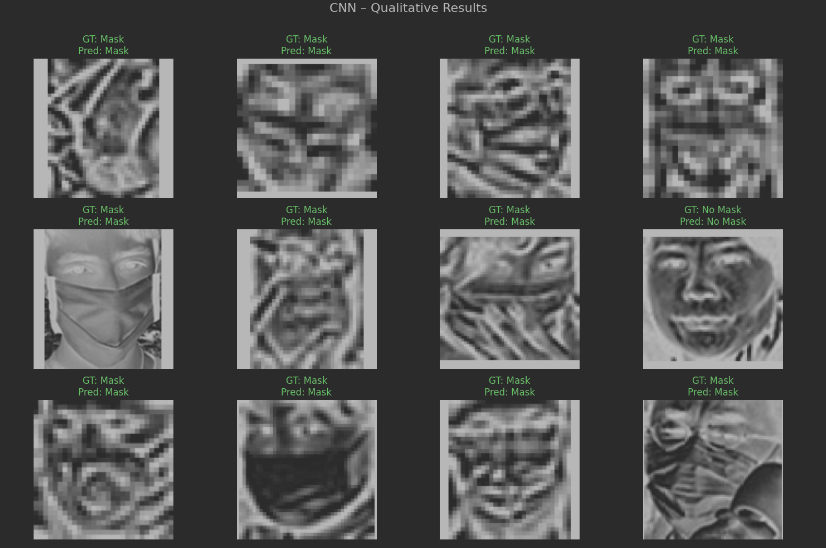
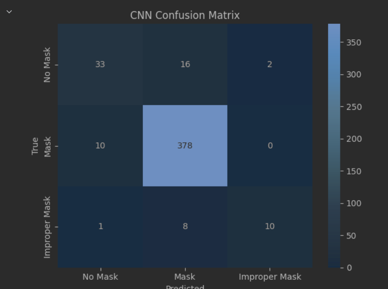
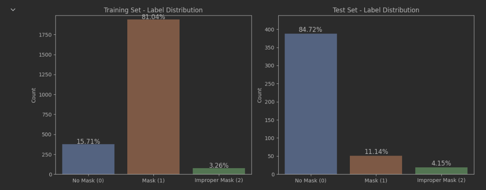

# MaskDetection
## Face Covering Detection

This project implements and compares multiple machine learning models for automatic **face covering detection** using image classification. It includes a training pipeline, evaluation of different model architectures, and a custom `MaskDetection` function for real-world testing.


---

## Data Exploration & Preprocessing

-  Verified dataset integrity: no corrupt or missing images  
-  Wide variation in image sizes; many images smaller than 50×50 pixels  
-  Detected class imbalance:
  - **Training set:** 81% Mask, 16% No Mask, 3% Improper  
  - **Test set:** 85% No Mask, 11% Mask, 4% Improper  
-  Resized all images to 128×128 with aspect-ratio preserving padding  
-  Enhancement pipeline: **CLAHE → Gaussian Blur → Sharpening**  
-  Data augmentation applied to balance classes:
  - Class 0 (No Mask): +752 images  
  - Class 2 (Improper): +702 images  
-  Final training set: 3848 images  
-  5-fold stratified K-Fold used for robust model evaluation  

---

##  Implemented Models

###  CNN (EfficientNetB0)
- Transfer learning with EfficientNetB0 backbone  
- Custom classifier head  
- Hyperparameters tuned with **Optuna**:
  - Batch size
  - Learning rate
  - Weight decay
  - Freeze ratio
  - Scheduler  
- Early stopping enabled  

###  SVM + HOG
- Extracted HOG features from grayscale images  
- Features flattened and standardized  
- Class-balanced SVM training with stratified 5-fold validation  
- Joint hyperparameter tuning (HOG + SVM) with **Optuna**  
- GPU acceleration used when available  

###  MLP + HOG
- HOG feature extraction with optimized parameters  
- Input features scaled using StandardScaler  
- Shallow MLP with:
  - 1 hidden layer
  - ReLU activation
  - Dropout regularisation  
- Hyperparameter tuning with **Optuna** and 5-fold validation  

### KNN + HOG
- HOG features with tuneable parameters (orientations, cell size)  
- StandardScaler for normalization  
- Distance-weighted KNN classification  
- Joint HOG + KNN hyperparameter optimization using **Optuna**  

---

##  Quantitative Results

| Model       | Accuracy | Macro Recall | Macro F1 | Weighted F1 |
|-------------|----------|---------------|----------|--------------|
| CNN         | **0.9148** | **0.82**       | **0.77**  | **0.92**       |
| KNN         | 0.8362   | 0.73          | 0.64     | 0.85         |
| MLP + HOG   | 0.8537   | 0.71          | 0.66     | 0.86         |
| SVM + HOG   | 0.7533   | 0.58          | 0.52     | 0.78         |

---

##  Mask Detection in the Wild

The `MaskDetection(path)` function performs qualitative evaluation of the best-performing model on new, unseen images.

## Function Capabilities

- Loads four random images from the specified folder
- Detects faces in the images using a YOLOv8 model (`yolov8m_200e.pt`)
- Applies an enhancement pipeline to each detected face:
  - CLAHE for contrast enhancement
  - Gaussian blur to reduce noise
  - Sharpening to improve edge clarity
- Crops, pads, and resizes faces to 128×128 pixels with preserved aspect ratio
- Applies normalization and transforms required for CNN input
- Passes each face through a pre-trained EfficientNetB0-based classifier
- Displays the original images with:
  - Bounding boxes drawn around detected faces
  - Predicted class labels: **No Mask**, **Mask**, or **Improper Mask**
  - Ground-truth labels parsed from filenames (if available)
  - Color-coded results: green for correct predictions, red for incorrect


---

## Project Structure

```
MaskDetection/
├── CV2024_CW_Dataset/
│   ├── test/
│   └── train/
│   └── Labels + images (original dataset)
│
├── ModifiedDataset/
│   ├── AugmentedData/
│   │   ├── test/
│   │   └── train/
│   └── kfold_splits.json       # Stratified K-Fold configuration
│
├── Models/                     # Trained model checkpoints
│   └── (Saved model files)
│
├── Notebooks/
│   ├── 1.DataExploration.ipynb
│   ├── 2.DataVisualization.ipynb
│   ├── 3.Preprocessing.ipynb
│   ├── 4.ModelDevelopmentCNN.ipynb
│   ├── 4.ModelDevelopmentKNN.ipynb
│   ├── 4.ModelDevelopmentMLP.ipynb
│   ├── 4.ModelDevelopmentSVM.ipynb
│   └── 5.EvaluatingModels.ipynb
│
├── PersonalDataset/           # Custom test images for real-world validation
│   └── (Images for MaskDetection)
│
├── YOLOModel/
│   └── yolov8m_200e.pt        # YOLOv8 pre-trained model weights
│
├── test_function.ipynb        # Inference test notebook for MaskDetection
├── README.md
└── .gitignore

```





---
